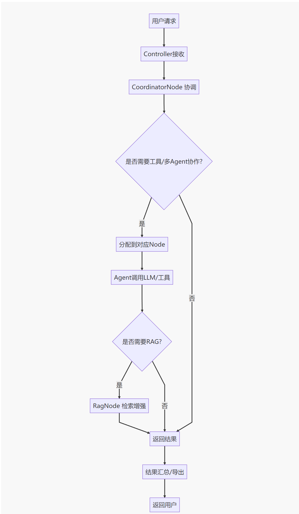
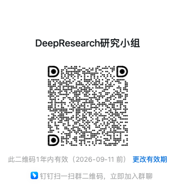

English version | 英文版

[中文文档](README.md)

Deep Research implemented based on spring-ai-alibaba-graph.

## Architecture


> The diagram shows the layered architecture and main call relationships of the core modules in deepresearch.

## Main Flow



> The diagram shows the primary flow of a user request within the deepresearch system.

<video width="640" height="360" controls>
<source src="../deepresearh-display.mp4" type="video/mp4">
</video>


## Configuration

### Required

- DashScope API: `${AI_DASHSCOPE_API_KEY}`
  
  DashScope API key
- TavilySearch API: `${TAVILY_API_KEY}`
  
  TavilySearch API key
- Report export path: `${AI_DEEPRESEARCH_EXPORT_PATH}`
  
  TIP: if omitted, files will be stored in the project root

### Optional

**Search Services (default: Tavily)**

- Jina API: `${JINA_API_KEY}`
- aliyunaisearch:
  - api-key: `${ALIYUN_AI_SEARCH_API_KEY}`
  - base-url: `${ALIYUN_AI_SEARCH_BASE_URL}`

**Storage Options (default: in-memory)** 

- redis: `${REDIS-PASSWORD}`
  
  Redis password; TIP: defaults to localhost:6379

**Coding Node (programming capability for LLM)**

- The Python executor of the Coder node runs inside a Docker container and requires Docker configuration.
  - Set `spring.ai.alibaba.deepresearch.python-coder.docker-host` in the config file; default is `unix:///var/run/docker.sock`.
  The project uses the `python:3-slim` image to create ephemeral containers. You can customize an image that includes common third-party libraries. Install them under `/app/dependency` inside the image, and set `spring.ai.alibaba.deepresearch.python-coder.image-name` to the image name in the config file.

**RAG**

- ElasticSearch: 
    - In `application.yml`, set `spring.ai.alibaba.deepresearch.rag.enabled: true`
    - In `application.yml`, set `spring.ai.alibaba.deepresearch.rag.vector-store-type: elasticsearch`
    - In `application.yml`, configure `spring.ai.alibaba.deepresearch.rag.elasticsearch` with ES connection details
    - Start ES middleware from the project root with the command below
        ```shell
        docker compose -f docker-compose-middleware.yml up -d
        ```
    - In the Knowledge Base page, create a new knowledge base and upload documents to ES

**MCP Services (WIP)**

- AMap MCP

```json
{
    "researchAgent": {
        "mcp-servers": [
            {
                "url": "https://mcp.amap.com?key=${AI_DASHSCOPE_API_KEY}",
                "sse-endpoint": null,
                "description": "This is an AMap service",
                "enabled": false
            }
        ]
    }
} 
```


## Related APIs, Tools, and MCP Integration Docs

- DashScope (Alibaba Bailian): https://bailian.console.aliyun.com

- Tavily API Docs: https://docs.tavily.com/documentation/api-reference/endpoint/search
- Jina API Docs: https://jina.ai/reader
- AMap MCP Docs: https://lbs.amap.com/api/mcp-server/gettingstarted#t1


## Getting Started
### Quick Start
Right-click the `DeepResearchApplication` class and run it.

### Run with Maven
From the project root, run with Maven:
```angular2html
mvn spring-boot:run
```


### Run with Docker
- Build the Docker image from the project directory. This may take ~5 minutes depending on network speed.
```shell
docker build -t alibaba-deepresearch:v1.0 . 
```
- After building, run the container and set environment variables:
```shell
docker run -d \
  --name alibaba-deepresearch \
  -e AI_DASHSCOPE_API_KEY="your_key_here" \
  -e TAVILY_API_KEY="your_key_here" \
#  -e JINA_API_KEY="your_key_here" \ optional
  -p 8080:8080 \
  alibaba-deepresearch:v1.0
```
- Alternatively, use docker-compose to start Redis, ElasticSearch, and the app:
```shell
  docker-compose up
```
> **Note**:
> - Set API keys in the `.env` file
> - Config files are under `dockerConfig`; you can also set keys and related configs there

**Test Cases**
See `DeepResearch.http` for sample requests.

```curl
curl --location 'http://localhost:8080/chat/stream' \
--header 'Content-Type: application/json' \
--data '{
    "thread_id": "__default_",
    "enable_deepresearch": false,
    "query": "Please analyze the reasons for the explosive popularity of Pop Mart",
    "max_step_num": 2,
    "auto_accepted_plan": true
}'
```

**Debugging & Observability**

Langfuse Configuration

#### Using Langfuse Cloud
1. Sign up at [https://cloud.langfuse.com](https://cloud.langfuse.com)
2. Create a new project
3. Go to **Settings** → **API Keys**
4. Generate a new API key pair (public and secret)
5. Encode the credentials to Base64:
   ```bash
   echo -n "public_key:secret_key" | base64
   ```
   ```Windows PowerShell
   [System.Convert]::ToBase64String([System.Text.Encoding]::UTF8.GetBytes("public_key:secret_key"))
   ```
6. In your yml, select the endpoint and set the encoded string as env `YOUR_BASE64_ENCODED_CREDENTIALS`

Reference: https://langfuse.com/docs/opentelemetry/get-started

## Contributors

Thanks to the following contributors for improving this project (unordered):
- [yingzi](https://github.com/GTyingzi)
- [zhouyou](https://github.com/zhouyou9505)
- [NOBODY](https://github.com/SCMRCORE)
- [xiaohai-78](https://github.com/xiaohai-78)
- [VLSMB](https://github.com/VLSMB)
- [disaster1-tesk](https://github.com/disaster1-tesk)
- [Allen Hu](https://github.com/big-mouth-cn)
- [Makoto](https://github.com/zxuexingzhijie)
- [sixiyida](https://github.com/sixiyida)
- [Gfangxin](https://github.com/Gfangxin)
- [AliciaHu](https://github.com/AliciaHu)
- [swl](https://github.com/hbsjz-swl)
- [huangzhen](https://github.com/james-huangzhen)
- [Tfh-Yqf](https://github.com/Tfh-Yqf)
- [anyin-xyz](https://github.com/anyin-xyz)
- [zhou youkang](https://github.com/mengnankkkk)
- [supermonkeyguys](https://github.com/supermonkeyguys)
- [yuluo-yx](https://github.com/yuluo-yx)
- [Ken Liu](https://github.com/chickenlj)
- [co63ox](https://github.com/co63oc)


Community Study Group



